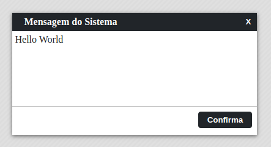

# Mofo v2.0

O mofo é uma janela de diálogo personalizada inspirada inicialmente no showModal do Delphi. 
Ele usa nativamente javascript em sua construção.

## Instalação

Clone o repositório em um diretório local.

```sh
    git clone git@github.com:guigagb/mofo-v2.git
```

## Importando

<h3>Forma 1</h3>

Para usar o mofo você deve chamá-lo em seu arquivo .js através de import.

```javascript
    import mofo from './mofo-v2';
```

<h3>Forma 2</h3>

Em seu html declare o arquivo js.

```html
    <script src="./mofo-v2.js"></script>
```

É necessário comentar/descomentar as linhas no arquivo mofo-v2.js:

```javascript
    export default (function() { //comentar essa linha
    let mofo = (function() { // descomentar essa linha
```

## Modo de uso

É necessário uma div no seu html com um id
```html
    <!DOCTYPE html>
    <html lang="pt-BR">
    <head>
        <title>Mofo v2.0</title>
    </head>
    <body>
        <div id="minhaDiv">Hello World!</div>
        <script src="index.js" type="module"></script>
    </body>
    </html>
```
No javascript iremos instanciar o objeto da seguinte forma:

```javascript
    const minhaDiv = new mofo.create({
    el: '#minhaDiv',
    height: 200,
    width: 400
})

//// Abre o modal
minhaDiv.open();
```

## Temas

<table>
    <tr>
        <th>mofo-blue</th>
        <th>mofo-opacity</th>
        <th>mofo-dark</th>
        <th>mofo-dark-square</th>
    </tr>
    <tr>
        <td></td>
        <td></td>
        <td></td>
        <td></td>
    </tr>
</table>

## Métodos

<h3>Create</h3>

Método responsável pela instância do mofo. Recebe um objeto como parâmetro que pode ter as seguintes propriedades passadas:

<table>
    <tr>
        <th align="center">Propriedades</th>
        <th align="center">Descrição</th>
        <th align="center">Tipo</th>
        <th align="center">Default</th>
    </tr>
    <tr>
        <td>el</td>
        <td>Id do elemento (div) onde será instanciado o mofo. <strong>(Obrigatório)</strong></td>
        <td align="center">String</td>
        <td align="center"></td>
    </tr>
    <tr>
        <td>title</td>
        <td>Título da janela.</td>
        <td align="center">String</td>
        <td align="center">Mensagem do Sistema</td>
    </tr>
    <tr>
        <td>width</td>
        <td>Largura da janela.</td>
        <td align="center">Numeric</td>
        <td align="center">innerWidth - 25%</td>
    </tr>
    <tr>
        <td>height</td>
        <td>Altura da janela.</td>
        <td align="center">Numeric</td>
        <td align="center">innerHeight - 25%</td>
    </tr>
    <tr>
        <td>resize</td>
        <td>Propriedade que informa se poderá redimensionar a janela.</td>
        <td align="center">Boolean</td>
        <td align="center">False</td>
    </tr>
    <tr>
        <td>theme</td>
        <td>Tema que será utilizado na janela, temas disponíveis:<br>
        mofo-blue, mofo-opacity, mofo-dark </td>
        <td align="center">String</td>
        <td align="center">mofo-blue</td>
    </tr>
    <tr>
        <td>left</td>
        <td>Define a posição (left) onde a janela será aberta.</td>
        <td align="center">Numeric</td>
        <td align="center"></td>
    </tr>
    <tr>
        <td>top</td>
        <td>Define a posição (top) onde a janela será aberta.</td>
        <td align="center">Numeric</td>
        <td align="center"></td>
    </tr>
    <tr>
        <td>fullscreen</td>
        <td>Caso queira que a janela abre em tela cheia, informe true.</td>
        <td align="center">Boolean</td>
        <td align="center">False</td>
    </tr>
    <tr>
        <td>closeBtn</td>
        <td>Mostra o botão fechar no canto superior direito da janela</td>
        <td align="center">Boolean</td>
        <td align="center">True</td>
    </tr>
    <tr>
        <td>esc</td>
        <td>Determina se o botão esc pode fechar o modal.</td>
        <td align="center">Boolean</td>
        <td align="center">True</td>
    </tr>
    <tr>
        <td>modal</td>
        <td>Limita o acesso apenas a janela aberta.</td>
        <td align="center">Boolean</td>
        <td align="center">True</td>
    </tr>
    <tr>
        <td>titleDisplay</td>
        <td>Possibilita a visualização ou não da barra de título da janela.</td>
        <td align="center">Boolean</td>
        <td align="center">True</td>
    </tr>
    <tr>
        <td>onCreate</td>
        <td>Função que será executada ao instanciar o objeto, só executa uma vez.</td>
        <td align="center">Function</td>
        <td align="center"></td>
    </tr>
    <tr>
        <td>onOpen</td>
        <td>Função que será executada sempre que abrir a janela.</td>
        <td align="center">Function</td>
        <td align="center"></td>
    </tr>
    <tr>
        <td>onClose</td>
        <td>Função que será executa sempre que fechar a janela.</td>
        <td align="center">Function</td>
        <td align="center"></td>
    </tr>
    <tr>
        <td>onKeyDown</td>
        <td>Permite a janela escutar pressionamento de teclas e executar uma função para as teclas determinadas.<pre>
onKeyDown:{
    13: (e)=>{ console.log('você apertou enter') },    
    32: (e)=>{ console.log('você apertou espaço') },    
    'CTRL+13': (e)=>{ console.log('você apertou ctrl + enter') }
}
        </td>
        <td align="center">Object</td>
        <td align="center"></td>
    </tr>
    <tr>
        <td>buttons</td>
        <td>Botões que irão aparecer na janela.<pre>
buttons:{
    btn1:  // identificador do botão
    {
        html: 'Confirma', //texto do botão
        class: 'left',    // class do botão (opcional)
        click: (e)=>{
            // função que será executada ao 
            clicar no botão
        }   
    },
    btn2:{ // pode ser adicionado n botões }
}
        </pre></td>
        <td align="center">Object</td>
        <td align="center"></td>
    </tr>
    <tr>
        <td>execAfter</td>
        <td>Pressiona um botão após determinado tempo.
        <pre>execAfter{
            time: 10,           // tempo em segundos
            btn: 'confirma'     // nome do btn
        }</pre>
        </td>
        <td align="center">Object</td>
        <td align="center"></td>
    </tr>
</table>

## Desenvolvedores

Francisco Alves<br>
Guilherme Trindade